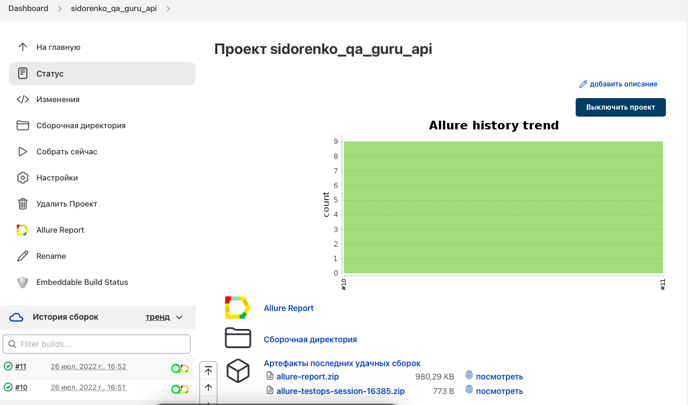
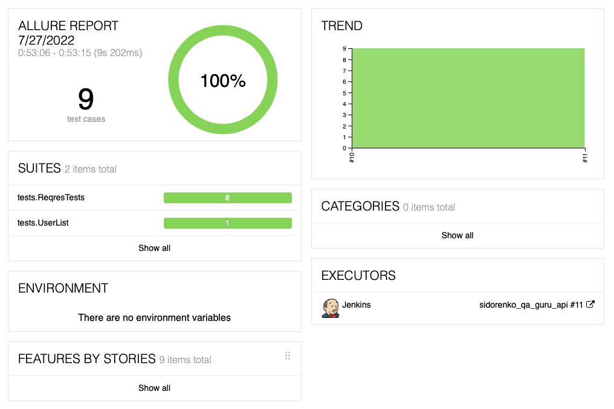
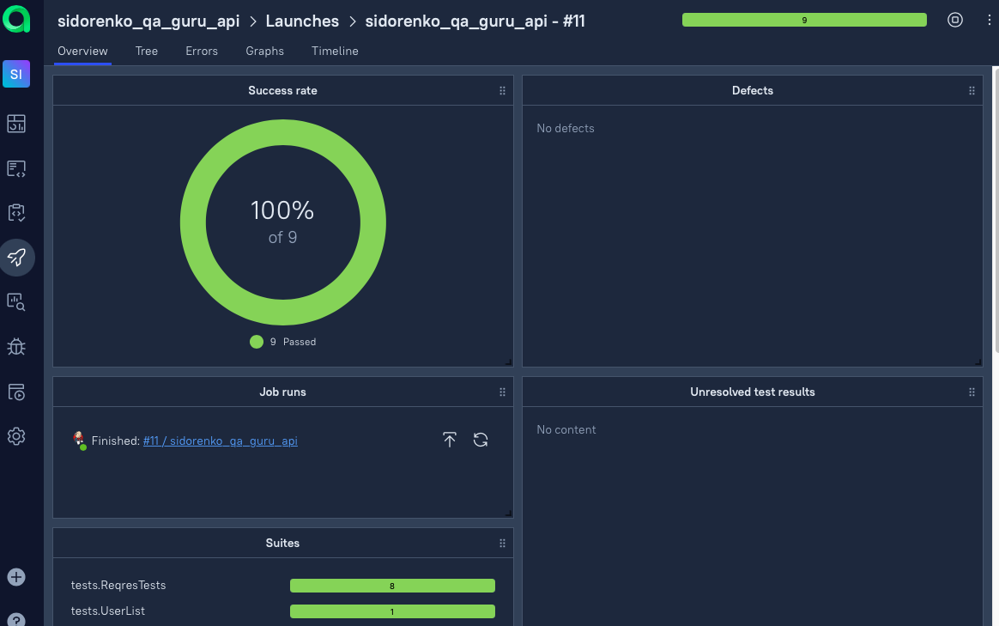
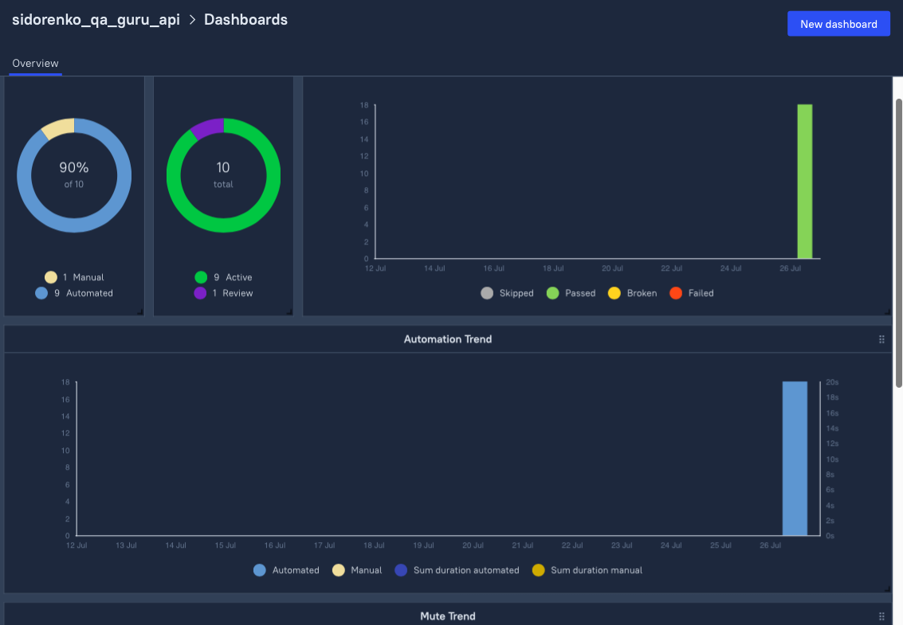
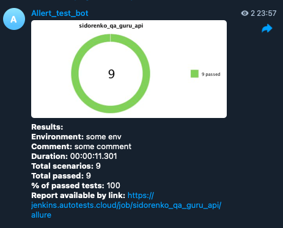

# Автоматизированные тесты для
https://reqres.in/
-----

## Содержание:

* <a>Технологии и инструменты</a>
* <a>Реализованные проверки</a>
* <a>Сборка в Jenkins</a>
* <a>Запуск из командной строки</a>
* <a>Allure отчет</a>
* <a>Интеграция с Allure Test Ops</a>
* <a>Отчет в Telegram</a>

## Технологии и инструменты
В проекте используются:

#### Список проверок, реализованных в автотестах
- [x] Вызов пользователя
- [x] Возвращение ошибки при отсутствии пароля
- [x] Вызов списка пользователей
- [x] Создание пользователя
- [x] Изменение данных пользователя
- [x] Удаление пользователя
- [x] Успешная регистрация пользователя
- [x] Проверка email в списке пользователей (Groovy)

## Сборка в Jenkins
Для удалённого запуска можно настроить запуск в Jenkins. Пример прогона:

## Запуск из командной строки

Реализована возможность как локального, так и удалённого запуска.

Для запуска используется команда: <code>gradle clean test</code>

В отдельный config-file вынесены настройки для запуска: адрес сайта, основной путь, одинаковый для всех тестов.

Пример файла с настройками можно посмотреть в src/test/resources/config, файл exampleCredentials.properties.

## Allure отчет
Результат прогона тестов можно посмотреть в отчёте. Информация в тесте представлена в виде шагов с действиями.

## Интеграция с Allure TestOps

## Отчет в Telegram
Результат прохождения тестов отправляется в Telegram с помощью бота. Пример сообщения с отчётом:

